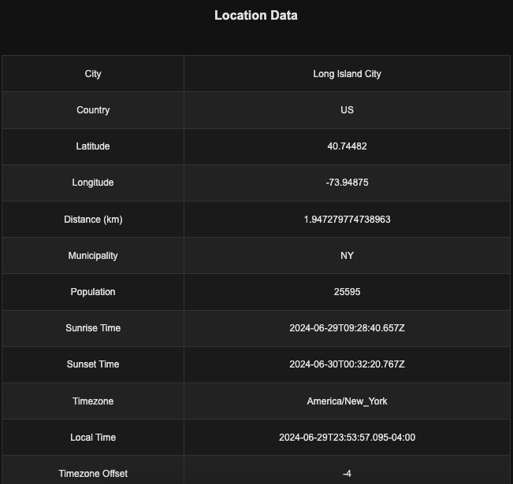

# getcity
This project is an example of how to accurately retrieve a user's location, city, and other data from a combination of browser location and a secure web service. In contrast to IP/Location techniques, this example is unaffected by proxies and reallocated IP addresses.

